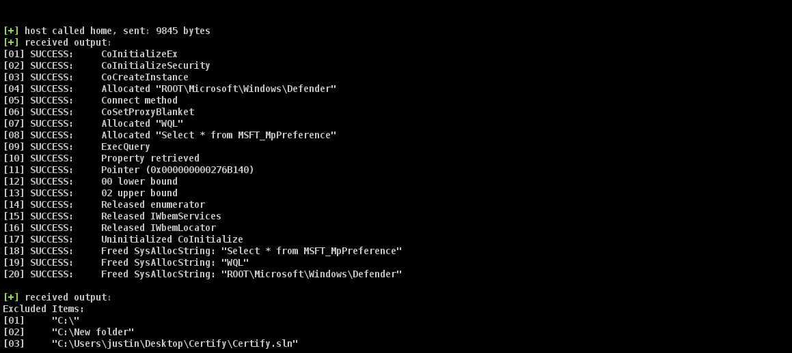
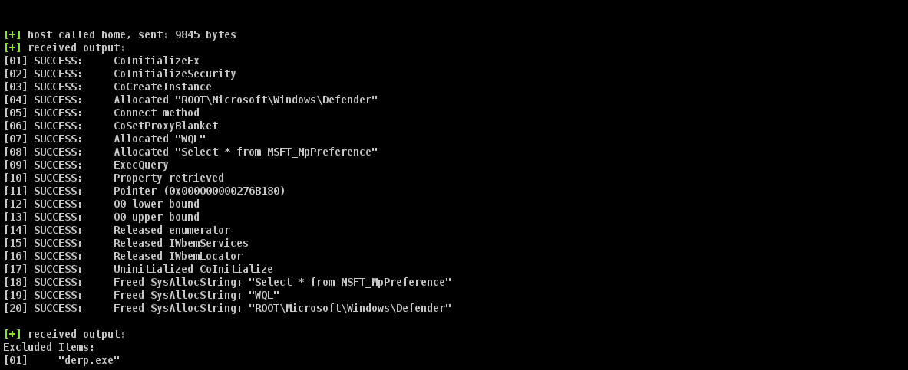
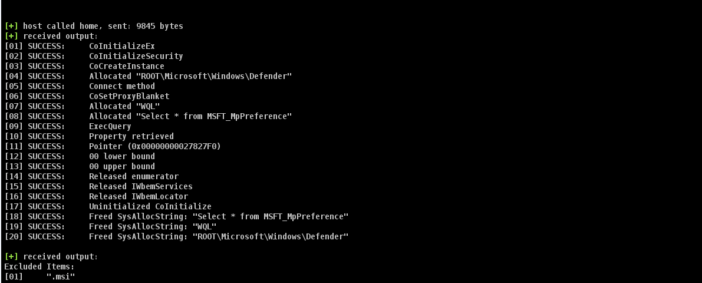

## Defender Exclusions BOF

---
#### What
A `BOF` to determine `Windows Defender` exclusions:
  - Extensions
  - Processes
  - Folders
---

#### Why
Examples of using the `C++` compiler to create `BOF`s without the need for the intermediary `vtable` dereferences.
---

#### Building
```sh
cd src
make all
```
---

#### Usage
1) Load `dist/cEnumerateDefender.cna`
2) Run in a `Beacon`:
    - `cEnumDefenderException [1-3]`
---

#### Outputs





